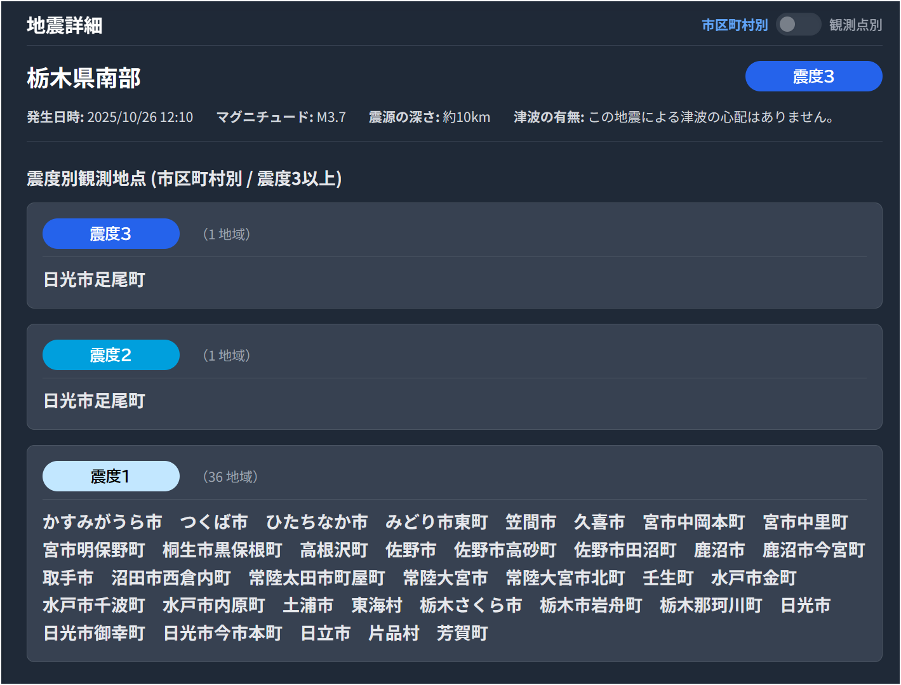

# 地震情報トラッカー 仕様書・操作マニュアル

## 1. アプリケーション概要

このアプリケーションは、P2P地震情報APIから直近の地震情報を取得し、**最大震度3以上**を観測した地震を一覧で表示するWebアプリケーションです。
選択した地震の詳細情報を確認できるほか、動画配信のテロップとして利用することを想定した「情報表示バー」機能を搭載しています。

## 2. 主な機能

*   **地震情報の自動取得・更新**: 定期的に最新の地震情報をAPIから取得し、画面に反映します。
*   **地震一覧表示**: 最大震度3以上の地震を発生時刻の新しい順に一覧表示します。
*   **地震詳細表示**: 選択した地震の震源地、マグニチュード、各地の震度などの詳細情報を表示します。
*   **表示モード切替**: 詳細表示パネルの震度別観測地点を「市区町村別」または「観測点別」で切り替えられます。
*   **情報表示バー（テロップ機能）**: 選択した地震の情報を、配信画面に載せることを想定したテロップ形式で表示・再生します。

## 3. 画面構成と操作方法

画面は大きく分けて「**地震一覧パネル**（左側）」「**地震詳細パネル**（右側）」「**情報表示バー**（画面下部）」の3つのエリアで構成されています。

### 3.1. 地震一覧パネル（左側）

| UI要素 | 機能説明 |
| :--- | :--- |
| **API更新ボタン** | クリックすると、手動で最新の地震情報に更新します。更新中は「取得中...」と表示されます。 |
| **最終取得日時** | 最後にAPIからデータを取得した時刻を表示します。 |
| **地震リスト** | 震度3以上の地震が一覧表示されます。各項目には「震源地」「発生時刻」「最大震度」「津波情報」が表示されます。 |
| | **操作**: リスト内の項目をクリックすると、右側の「地震詳細パネル」と下部の「情報表示バー」の内容がその地震の情報に更新されます。選択された項目は青くハイライトされます。 |

### 3.2. 地震詳細パネル（右側）

| UI要素 | 機能説明 |
| :--- | :--- |
| **市区町村別 / 観測点別**/n** トグルスイッチ** | 震度別観測地点の表示粒度を切り替えます。 ・**市区町村別**: 同じ市区町村内の複数の観測点は1つにまとめて表示します。（デフォルト） ・**観測点別**: 全ての観測点名を個別に表示します。 |
| **地震情報ヘッダー** | 選択した地震の「震源地」と「最大震度」を表示します。 |
| **サマリー情報** | 「発生日時」「マグニチュード」「震源の深さ」「津波の有無」に関する詳細情報を表示します。 |
| **震度別観測地点** | 設定された表示モード（市区町村別/観測点別）に基づき、震度3以上の揺れを観測した地域を震度別に一覧表示します。 |

### 3.3. 情報表示バー（画面下部）

選択した地震の情報を、配信テロップのように1ページずつ表示・再生するための機能です。

#### 操作パネル（左側）

| UI要素 | 機能説明 |
| :--- | :--- |
| **秒数入力欄** | 自動再生時の1ページあたりの表示時間を秒単位で設定します。（デフォルト: 10秒） |
| **ループ回数選択** | 自動再生を何回繰り返すかを選択します。（デフォルト: 3回, `∞`で無限ループ） |
| **◀ / ▶ ボタン** | 情報ページを手動で前後に送ります。自動再生中は無効になります。 |
| **ページ情報** | `現在のページ / 総ページ数` を表示します。自動再生中はループ回数も `L:現在のループ/総ループ` の形式で表示されます。 |
| **再生/停止ボタン** | 情報の自動ページ送りを開始・停止します。 |
| **トランジション選択** | ページ切り替え時のエフェクトを「カット」または「スライド」から選択します。 |
| **リセットボタン** | 情報表示バーの表示を初期状態（非表示）に戻します。自動再生も停止します。 |
| **キーボードアイコン** 　| クリックすると「設定」モーダルを開きます。 |

#### コンテンツ表示エリア（右側）

| UI要素 | 機能説明 |
| :--- | :--- |
| **震度バッジ** | 現在表示している情報ページの震度階級やカテゴリ（例: `概況`, `津波`）を表示します。 |
| **テキスト表示エリア** | 地震のサマリー情報や、震度ごとの観測地点名などを表示します。文字には黒い縁取りが適用されます。 |

### 3.4. 設定モーダル

| UI要素 | 機能説明 |
| :--- | :--- |
| **再生/停止ショートカット** | 情報表示バーの自動再生を開始/停止するためのキーボードショートカットを設定できます。入力欄を選択し、設定したいキーの組み合わせ（例: `Ctrl + Space`）を押してください。 |
| **情報画面に表示する最低震度** | 情報表示バーで再生される震度情報の最低ラインを設定します。例えば「震度4以上」に設定すると、震度3の地域情報は再生されなくなります。（デフォルト: 震度3以上） |
| **保存ボタン** | 設定した内容をブラウザに保存し、モーダルを閉じます。 |

## 4. 仕様詳細

*   **API**: P2P地震情報 API v2 を使用しています。
    *   地震情報（コード: 551）と津波情報（コード: 552）を取得しています。
*   **データ更新頻度**:
    *   **自動更新**: 2分ごと。
    *   **手動更新**: 「API更新」ボタン押下時。
*   **リスト表示対象**: APIから取得した直近100件のデータのうち、**最大震度が3以上** (`maxScale >= 30`) の地震。
*   **情報表示バーのページ分割**:
    *   サマリー情報や観測地点リストがテキスト表示エリアの2行に収まらない場合、自動的に複数のページに分割して表示します。
*   **設定の永続化**:
    *   「ショートカットキー」と「情報画面に表示する最低震度」の設定は、ブラウザのローカルストレージに保存され、次回アクセス時も維持されます。
